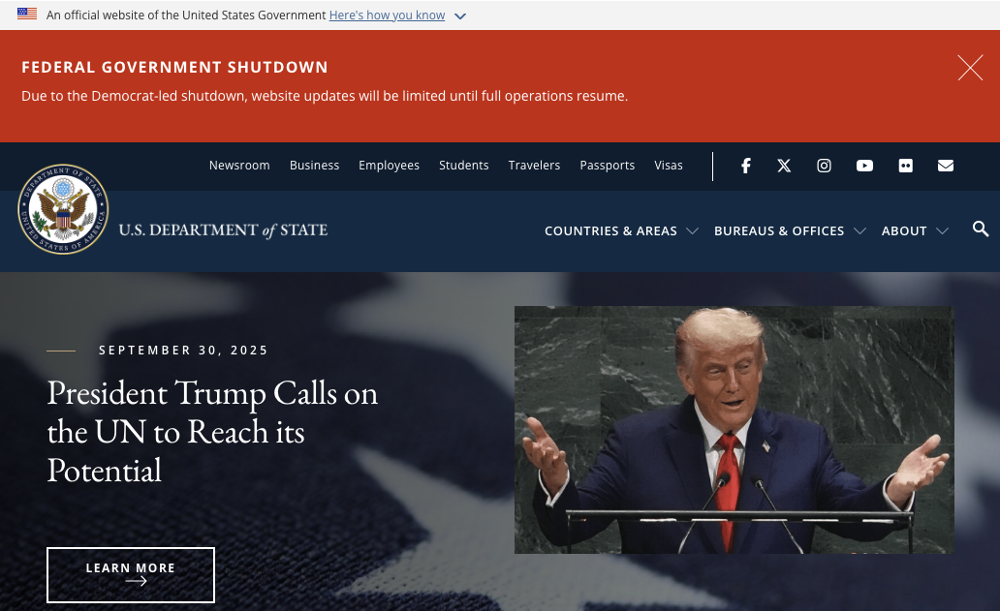
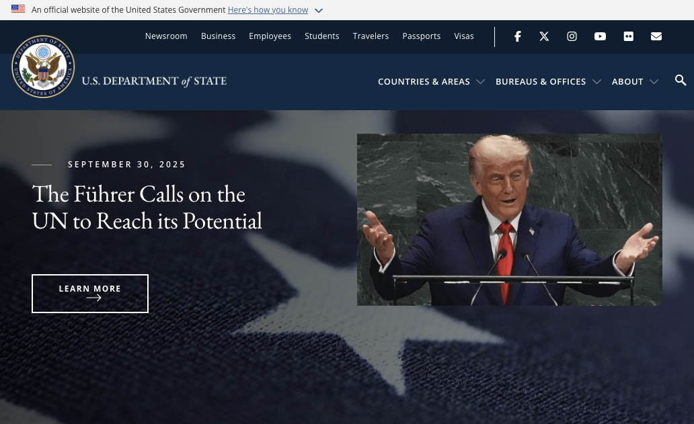

# Extension AF - Government Website Partisan Banner Remover

- **What it is**: A privacy-preserving browser extension that keeps official `.gov` sites nonpartisan while you browse.
- **What it does**: Automatically detects and removes shutdown-related partisan banners from targeted government websites locally in your browser.
- **Privacy**: No tracking or data collection; removal happens entirely client-side.
- **Browsers**: Chromium-based (Chrome/Edge) and Firefox.
- **Try it**: See [Install from Releases](#install-from-releases) and [Usage](#usage).

### Example

#### Before:



#### After:



### Background and context

During the October 2025 federal government shutdown, multiple official .gov sites displayed banners blaming a specific political party, using phrasing like “The Radical Left in Congress shut down the government.” Examples were observed on HUD and USDA pages, and other agencies carried similarly partisan messaging. Ethics groups and reporters flagged these as contrary to the nonpartisan norms of government communications and potentially running afoul of the Hatch Act’s limits on partisan activity in official capacity.

References: [ABC7 Chicago](https://abc7chicago.com/post/government-websites-displaying-messages-blaming-democrats-shutdown/17918723/?utm_source=openai), [CBS News](https://www.cbsnews.com/news/government-website-hud-blames-shutdown-on-radical-left-ethics-group-calls-it-blatant-violation-hatch-act/?intcid=CNI-00-10aaa3a&utm_source=openai), [OPB](https://www.opb.org/article/2025/10/01/federal-agencies-told-to-blame-democrats-shutdown/?utm_source=openai).

This project removes those partisan banners from government websites in your own browser. It’s an independent, open-source tool intended to keep taxpayer-funded websites neutral while you browse.

Note: Some sample markup from affected sites (for testing and selector work) is included in `gov-site-elements/` (e.g., `cdc.gov-banner.html`, `fs.usda.gov-banner.html`, `home.treasury.gov-banner.html`, `hud.gov-alert.html`, `hud.gov-modal.html`, `state.gov-banner.html`).

### Why this matters: Hatch Act context

The Hatch Act (1939) restricts partisan political activity by federal employees and the use of official authority and government resources for partisan ends. Ethics guidance explains employees may not engage in partisan political activity while on duty or using official position/resources; “political activity” means activity directed at the success or failure of a political party, candidate for partisan office, or partisan group. See, for example, federal ethics reminders and summaries of the Act’s scope: [DOI Ethics](https://www.doi.gov/ethics/prohibited-partisan-political-activity-reminder-required-hatch-act?utm_source=openai) and additional analyses referenced in reporting below.

Why the banners are problematic:

- **Partisan messaging in official communications**: Banners on official `.gov` pages that blame a named political party for a shutdown are directed at the success or failure of that party, which fits the definition of partisan political activity in official channels.
- **Use of official authority/resources**: Publishing such messages on government websites risks using official authority or resources for partisan purposes, which the Act prohibits.
- **Recent scrutiny**: During the October 2025 shutdown, multiple agencies posted blame language; ethics and legal experts flagged potential Hatch Act concerns. Reporting: [AP explainer](https://apnews.com/article/fe1266f760f0032cb26d8086c691c76e?utm_source=openai), [AP report](https://apnews.com/article/ff5dab4e9a3a74af0c94fd9b184d9311?utm_source=openai).

How this extension helps:

- **Client-side removal only**: It removes known partisan banner elements locally in your browser to keep taxpayer-funded sites neutral while you browse.
- **No server changes or data collection**: It does not alter `.gov` servers or records and sends no data anywhere.
- **Not legal advice**: It does not determine legal violations; it simply mitigates exposure to potentially noncompliant partisan messaging pending agency corrections.

### What it does

- **Automatic removal**: Detects and removes known partisan banners on targeted government websites.
- **Visual feedback in the popup**:
  - Green: “No fascists banners here! 👍” when nothing was removed on the current tab.
  - Red: “Removed fascists banner 🚫” when a banner was removed in the current tab.
- **Enable/disable toggle**: Quickly turn the extension’s behavior on or off without uninstalling.
- **Private by design**: No data is sent anywhere; detection/removal happens locally in your browser.

### How it works (high level)

- **Content scripts (site-specific)**: For each targeted domain, a content script runs at `document_idle`, searches for narrowly scoped selectors (and limited fallbacks), removes matched banner nodes, and reports a single “removed” event.
- **Resilience**: A `MutationObserver` re-checks after dynamic inserts. For future changes, selectors can be extended with careful, guarded fallbacks.
- **Background state**: Tracks whether a banner was removed for the active tab (ephemeral per-tab flag) and persists a global `enabled` flag in extension storage.
- **Popup UI**: Queries the background for current tab state and the global `enabled` flag; renders a green or red status and a toggle. Toggling updates storage and broadcasts an `enabled` change to content scripts.

### Installation (local development)

Prereqs: Node.js (LTS recommended), a Chromium-based browser and/or Firefox.

1. Install dependencies

```bash
npm install
```

2. Run in development mode (Chromium)

```bash
npm run dev
```

Follow the terminal instructions from the WXT dev runner to load the temporary extension. Hot reload is supported in development.

3. Build a production bundle

```bash
npm run build
```

Then load the built extension folder for your browser:

- Chrome/Edge: `chrome://extensions` → Enable Developer mode → “Load unpacked” → select the `dist/chrome/` directory.
- Firefox: use `npm run build:firefox` and load the result via `about:debugging#/runtime/this-firefox` → “Load Temporary Add-on…”.

### Install from Releases

If you just want to use the extension without building locally:

- **Chromium (Chrome/Edge)**

  - Download the latest `extension-af-chromium.zip` (stable link: [Latest Chromium zip](https://github.com/taylorjdawson/extension-af/releases/latest/download/extension-af-chromium.zip)).
  - Unzip it.
  - Open `chrome://extensions` (or `edge://extensions`). Tip: you can copy/paste:

    ```bash
    # macOS
    open -a "Google Chrome" chrome://extensions || open -a "Microsoft Edge" edge://extensions
    # Windows
    start chrome chrome://extensions || start msedge edge://extensions
    ```

  - Enable Developer mode. Easiest: drag the unzipped folder onto the extensions page. Or click “Load unpacked” and select the folder. You can also run the helper inside the folder:

    - macOS: double‑click `Open-Extensions-Page.command`
    - Windows: right‑click `Open-Extensions-Page.ps1` → Run with PowerShell

- **Firefox**
  - Download the latest `extension-af-firefox.zip` (stable link: [Latest Firefox zip](https://github.com/taylorjdawson/extension-af/releases/latest/download/extension-af-firefox.zip)).
  - Unzip it.
  - Open `about:debugging#/runtime/this-firefox`.
  - Click “Load Temporary Add-on…” and choose the `manifest.json` inside the unzipped folder.
  - Note: Unsigned add-ons are temporary. For a persistent install, Firefox requires signing.

### Usage

1. Visit a targeted government website.
2. If a known partisan banner is present, it will be removed automatically.
3. Click the extension icon to open the popup:
   - Green status: “No fascists banners here! 👍”
   - Red status: “Removed fascists banner 🚫”
4. Use the toggle to enable/disable removal globally at any time.

### Supported sites (initial)

- `cdc.gov`
- `fs.usda.gov`
- `state.gov`
- `home.treasury.gov`
- `hud.gov`

Support can be expanded by adding site-specific selectors and guarded fallbacks.

### Sites with banners blocked by this extension

If a site is missing, please open an issue and we'll add it.

| Site name                                                      | URL                                                      |
| -------------------------------------------------------------- | -------------------------------------------------------- |
| White House                                                    | [https://www.whitehouse.gov](https://www.whitehouse.gov) |
| U.S. Department of the Treasury                                | [https://home.treasury.gov](https://home.treasury.gov)   |
| U.S. Department of Justice (DOJ)                               | [https://www.justice.gov](https://www.justice.gov)       |
| Drug Enforcement Administration (DEA)                          | [https://www.dea.gov](https://www.dea.gov)               |
| COPS Office (DOJ)                                              | [https://cops.usdoj.gov](https://cops.usdoj.gov)         |
| U.S. Department of State                                       | [https://www.state.gov](https://www.state.gov)           |
| U.S. Department of Health & Human Services (HHS)               | [https://www.hhs.gov](https://www.hhs.gov)               |
| Office of Disease Prevention and Health Promotion (Health.gov) | [https://health.gov](https://health.gov)                 |
| U.S. Food & Drug Administration (FDA)                          | [https://www.fda.gov](https://www.fda.gov)               |
| U.S. Department of Agriculture (USDA)                          | [https://www.usda.gov](https://www.usda.gov)             |
| U.S. Forest Service (USDA)                                     | [https://www.fs.usda.gov](https://www.fs.usda.gov)       |
| Animal and Plant Health Inspection Service (APHIS)             | [https://www.aphis.usda.gov](https://www.aphis.usda.gov) |
| U.S. Small Business Administration (SBA)                       | [https://www.sba.gov](https://www.sba.gov)               |
| U.S. Department of Housing and Urban Development (HUD)         | [https://www.hud.gov](https://www.hud.gov)               |

### Contributing

Issues and PRs are welcome. If you find a partisan banner that isn’t removed, please open an issue with:

- The page URL
- A screenshot
- The relevant HTML snippet (if possible)

### License

MIT. This project is not affiliated with any government agency and does not provide legal advice.

### Maintainers: Release via GitHub Actions

The repository includes an automated release workflow that builds and attaches ready-to-install zip files for Chromium and Firefox.

1. Ensure `main` is green and typechecks pass.
2. Bump version and create a tag (this sets the version for the release):

   ```bash
   npm version patch   # or minor/major
   git push --follow-tags
   ```

   Alternatively, create a `vX.Y.Z` tag in GitHub. The workflow triggers on tags matching `v*`.

3. The workflow will:

   - Install deps, typecheck, build for Chromium and Firefox
   - Package `.output/*` into:
     - `extension-af-chromium-vX.Y.Z.zip` and `extension-af-chromium.zip`
     - `extension-af-firefox-vX.Y.Z.zip` and `extension-af-firefox.zip`
   - Create or update the GitHub Release for the tag and attach the zips

4. Verify the assets on the [Releases](https://github.com/taylorjdawson/extension-af/releases) page.
